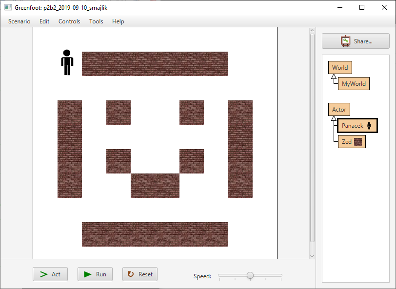

# Vývojové prostředí Greenfoot

_Greenfoot_ je vývojové prostředí, určené pro výuku objektově orientovaného programování. Budoucí programátor má k&nbsp;dispozici předpřipravené třídy a&nbsp;vývojové prostředí, ve kterém píše vlastní kód a&nbsp;tvoří tak jednoduché 2D počítačové hry. Zároveň se tím seznamuje s&nbsp;pravidly psaní kódu a&nbsp;s&nbsp;programováním samotným. Prostředí Greenfoot je zdarma, vyvíjí a&nbsp;podporují je King‘s College London a&nbsp;Oracle®. V&nbsp;Greenfootu můžete psát kód hry v&nbsp;jazycích Java nebo Stride.
Prostředí Greenfootu budeme používat v&nbsp;této učebnici běžně, takže popis necháme do dalších kapitol.

