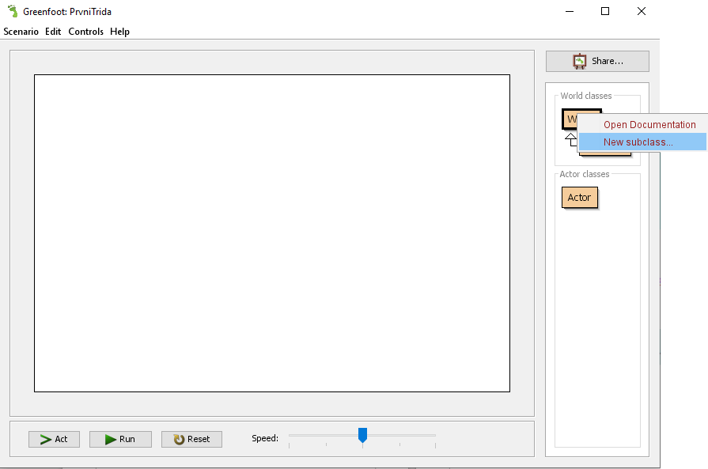
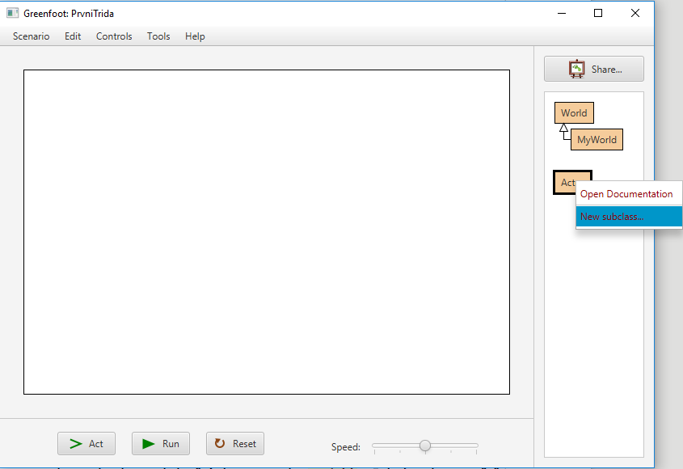
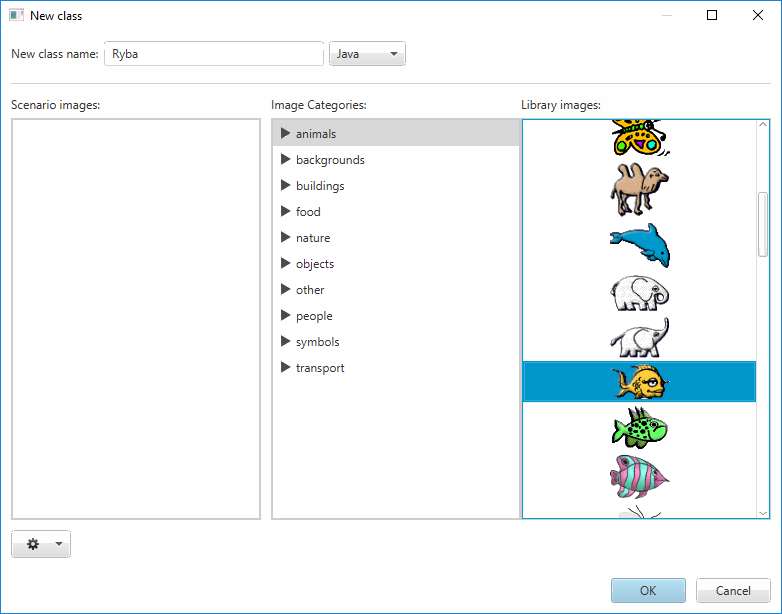

# Svět a&nbsp;aktéři

Pojďme se nyní zorientovat v&nbsp;prostředí Greenfoot. Potřebuješ pochopit, jak s&nbsp;prostředím pracovat.

## Svět hry &mdash; _World_

_Svět_ hry reprezentuje jednu obrazovku hry. Může se jednat o&nbsp;jednu úroveň (level) hry, nebo také třeba o úvodní či závěrečnou obrazovku.

V Greenfootu můžeš vytvořit více „světů/obrazovek“. V&nbsp;začátcích to ale nebudeš potřebovat. Zatím ti bude stačit vždy jen jednen svět s&nbsp;názvem `MyWorld`. Ten vytvoříš tak, že:

1. klikneš pravým tlačítkem na položku _World_ vpravo v&nbsp;nabídce objektů 
2. a&nbsp;zvolíš _New subclass…_.

## Aktéři hry &mdash; _Actor_

_Aktéři_ reprezentují jednotlivé objekty ve hře – figurky, předměty, překážky,... Aktéři mají přiřazenu grafickou podobu a můžeš je umístit do některého prostředí/světa.
Vyzkoušej si vytvořit třeba aktéra s&nbsp;názvem `Ryba`: 

1. Klikni pravým tlačítkem na položku _Actor_
2. a&nbsp;zvol _New subclass…_. 
3. Následně zapiš jako název třídy `Ryba`, jazyk zvol _Java_ a&nbsp;vyber vhodný obrázek.

> POZOR! Při vymýšlení názvů tříd bys měl(a) dodržovat pravidla:
> 1. Názvy tříd by vždy měly začínat velkými písmenem! 
> 2. Pokud se název třídy skládá z více slov, začíná vždy další slovo opět velkým písmenem.
> 3. Doporučujeme nepoužívat znaky s diakritickými znaménky (háčky, čárky, kroužky).
> 4. V názvu tříd nesmí být mezery ani pomlčky!
>  
> Příklady správně zapsaných názvů tříd jsou například: 
> `Ryba`, `ZavodniAuto`, `Panacek`, `ExplozeVelka`, `ExplozeMala`, `Kyticka`, `RuzovyDort`,...
