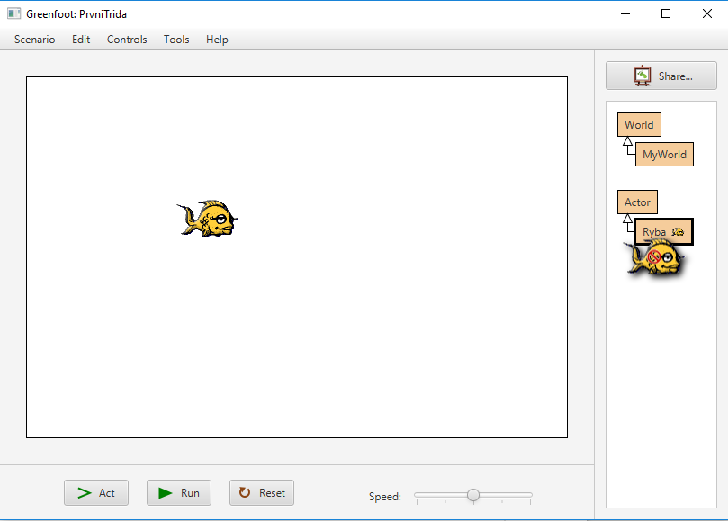
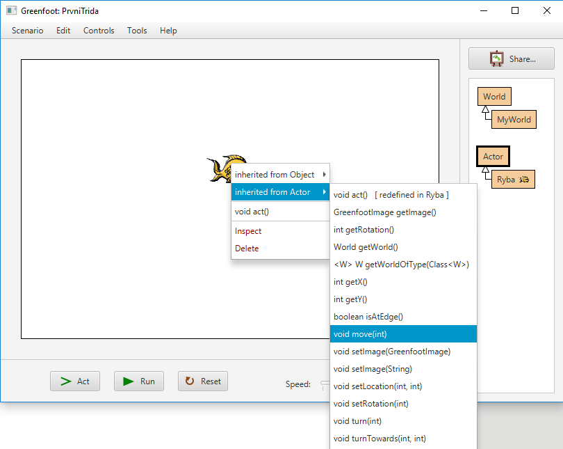

# Interaktivní pokusy

## Vložení aktérů do prostředí v&nbsp;Greenfootu – ručně

Jakmile máte v&nbsp;pravé části okna k&nbsp;dispozici aktéry, můžete je umístit do světa hry (na hrací plochu). Vždy mějte na mysli, že položka v&nbsp;pravé části okna je vlastně šablona, podle které vytváříte skutečné aktéry. V&nbsp;programování takovou šablonu nazýváme „třída“ (anglicky „class“). Pokud jste si tedy například vytvořili (šablonu) aktéra Ryba, pak můžete na plochu umístit libovolné množství konkrétních objektů, vytvořených podle této šablony – instancí třídy Ryba 
Vytvoření objektu a&nbsp;jeho umístění na plochu provedeme tak, že klikneme na položku Ryba pravým tlačítkem a&nbsp;v kontextovém menu zvolíme „new Ryba“. Tím vytvoříme první rybu. Kurzor myši se změní v&nbsp;obrázek ryby. My potom klikneme levým tlačítkem do okna hry na místo, kam chceme rybu umístit.

> Podrobnější vysvětlení pojmů _třída_, _objekt_ a&nbsp;_instance_ najdeš v&nbsp;dalších kapitolách. Zatím si ale především potřebuješ věci vyzkoušet v&nbsp;praxi.

<!-- begin:Akce-->
Pojď si to vyzkoušet:
1. Vytvoř si ručně aktéry (šablony aktérů – třídy) „Květina“ a „Žába“.
2. Vytvoř pět květin a&nbsp;tři žáby. Všechny vytvořené objekty umísti na plochu hry.
<!-- end:Akce-->

Všimně si, že když stiskneš tlačítko „Reset“ v&nbsp;okně Greenfootu pod hrací plochou, nebo když Greenfoot vypnete, všechny vytvořené objekty zmizí. Je to proto, že ruční vytváření objektů je určené pouze pro testování. My se chceme naučit programovat – chceme, aby počítač vytvářel objekty sám. Neboj, dojdeme k&nbsp;tomu v&nbsp;další kapitole!

## Posílání zpráv objektům – ručně
Pojďme si ale vyzkoušet ještě posílání zpráv jednotlivým aktérům (objektům). Jak už jste zjistili, objekty samy o&nbsp;sobě se nepohybují, ani na nic nereagují. Pokud chceme, aby objekt něco provedl, musíme mu poslat zprávu. 

<!-- begin:Akce-->
Zkus to: 
1. Vytvořte si aktéra a&nbsp;umístěte ho do světa. (Můžete použít některý z&nbsp;objektů, který už máte z&nbsp;minula.)
2. Klikněte na aktéra pravým tlačítkem a&nbsp;zvolte položku Inherited from Actor → move(int). Vyskočí textové okénko, kde zadáš, o&nbsp;kolik pixelů (bodů) se má aktér pohnout. Protože je jeden pixel velmi malý, zadej třeba 200.
3. Aktér by se na obrazovce měl posunout o&nbsp;200 pixelů. Skutečná vzdálenost závisí na rozlišení vaší obrazovky. (Běžně se dnes používají obrazovky, které mají 1920 pixelů a šířku, takže 200 pixelů je desetina šířky obrazovky. Ale můžete mít i&nbsp;vyšší nebo občas nižší rozlišení a&nbsp;pak to bude jinak. Svět hry v&nbsp;Greenfootu má standardně šířku 600 pixelů, takže 200 pixelů by měla být třetina šířky okénka.)
<!-- end:Akce-->

Můžeš si vyzkoušet posílání dalších zpráv. Většina těch zajímavých bude v&nbsp;záložce _Inherited from Actor_. Můžeš si vyzkoušet třeba:

- `move(5)` … Posune aktéra o&nbsp;5 dílků směrem, kterým je otočený.
- `turn(90)` … Otočí aktéra o&nbsp;zadaný počet stupňů doprava. 180 stupňů znamená, že se aktér otočí „čelem vzad“, 90 nebo 270 stupňů otočí aktéra doprava či doleva. Pokud zadáte 360 stupňů, nic se nezmění, protože se aktér otočí o&nbsp;celé kolo a&nbsp;skončí ve stejné poloze.
- `isAtEdge()` … zjistí, jestli se aktér dotýké okraje obrazovky.
- `getX()`, `getY()` … zjistí pozici aktéra na ose X, respektive Y.

> Zanedlouho se naučíme, že si můžeš připravit vlastní typy zpráv, na které bude aktér umět reagovat. Třeba ryby můžeme naučit zprávu „plav()“, která způsobí, že se ryba bude dále pohybovat sama. Ale pojďme pěkně popořádku. Zatím umíš objektům posílat zprávy ručně. 

<!-- end:Ukol-->
> Úkol
>
> 1. Vlož do světa `MyWorld` ručně 10 objektů třídy `Ryba`. 
> 2. Každou umísti jinam a&nbsp;zkontroluj, že každá reaguje jinak na zprávu `getX()` – každá vrací jinou pozici. 
> 3. Vyzkoušej také, že reakce na zprávu `getX()` se změní poté, co rybě pošleme zprávu `move(10)` a&nbsp;posuneme ji tak na jiné místo.
<!-- end:Ukol-->
