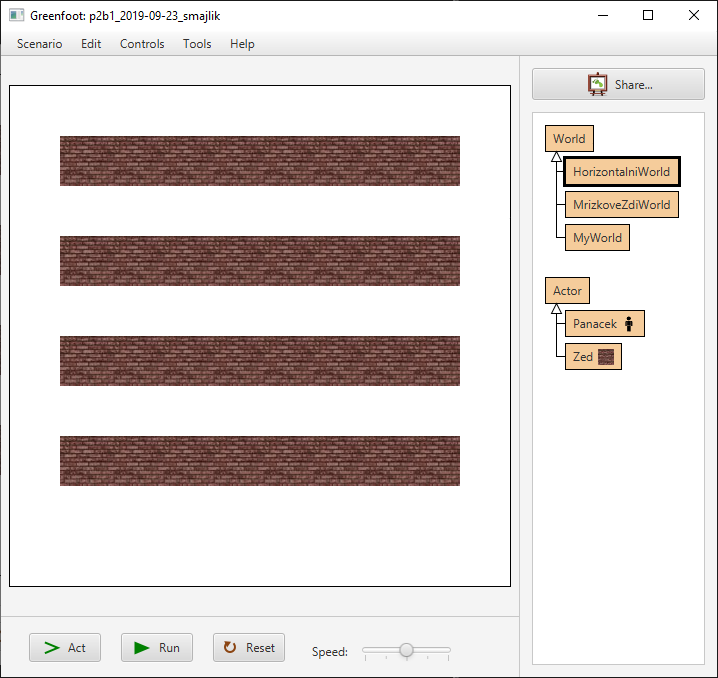

# Cyklus `for`

Cykly (anglicky _loops_) používáme v&nbsp;programování tehdy, kdy chceme nějakou posloupnost operací zopakovat vícekrát za sebou. Přitom můžeme počet opakování znát předem, nebo může být uložen v&nbsp;proměnné. Je také možné, že počet opakování předem neznáme &mdash; například když chceme zopakovat pro všechny prvky ze seznamu nebo pro všechny položky v&nbsp;souboru. Existuje více typů cyklů, které si postupně představíme.

Cyklus `for` používáme tehdy, kdy víme přesně, kolikrát máme posloupnost příkazů provést. Přitom počet opakování může být klidně uložen v&nbsp;proměnné, není nezbytné, abychom znali konkrétní hodnotu počtu opakování. 

> Cyklus `for` tedy využijeme, když potřebujeme povést nějakou akci 10krát, ale také tehdy, když nějakou akci chceme provést tolikrát, jaké číslo je uloženo v nějaké proměnné.

Syntaxe:
```java
for (int i = 0; i < kolikratProvest; i++)
{
	// Posloupnost příkazů: Co se má provádět opakovaně.
}
```

Rozeberme si zápis podrobněji. Píšeme postupně: 
1. `for (` 
2. `int i = 0` ... příkaz, který se provede jednou: vytvoření řídící proměnné `i` a nastavení na hodnotu `0`
3. `;` ... středník (pozor, nikoli čárka, jak občas žáci píší)
4. `i < kolikratProvest` ... podmínka: dokud podmínka platí, bude se cyklus opakovat
5. `;` ... středník
6. `i++` ... kód, který zvýší hodnotu proměnné `i` o&nbsp;`1` (šlo by i&nbsp;`i = i+1`)
7. `) {` ... konec závorek a složené závorky
8. kód, který se má opakovat
9. `}` ... ukončení složených závorek

## Příklad 1:
Vypíšeme 5krát „Ahoj světe!“:
```java
for (int i = 0; i < 5; i++)
{
	System.out.println("Ahoj světe!"); 
}
```
Výstup bude vypadat takto:
```
Ahoj světe!
Ahoj světe!
Ahoj světe!
Ahoj světe!
Ahoj světe!
```

> V&nbsp;Greenfootu si příklady vyzkoušejte tak, že:
> - kód zapíšete do konstruktoru světa,
> - výpis se objeví v&nbsp;okně, které vyskočí.<br />(Pozor, ať si okno s&nbsp;výstupem neschováte pod okno Greeenfootu).

## Příklad 2:
Vypíšeme text `"Pozdrav číslo N"` tolikrát, jaká hodnota je uložena v&nbsp;proměnné `pocet`. Přitom za „N“ vždy dosadíme pořadové číslo pokusu.
```java
int pocet = 5;
for (int i = 1; i <= pocet; i++)
{
	System.out.println("Pozdrav číslo "+i);
}
```
Výstup bude vypadat takto:
```
Pozdrav číslo 1
Pozdrav číslo 2
Pozdrav číslo 3
Pozdrav číslo 4
Pozdrav číslo 5
```

> Všimni si, že nemusíme vždy začínat od nuly. Pokud ale proměnnou `i` používáme pouze pro odpočítání správného počtu průchodů cyklem, je zvykem začínat od `0`.

## Příklad 3
Vytvoříme 15 aktérů třídy `Kvetina`. 

Příprava: Kód zapište do konstruktoru třídy `MyWorld`. Vytvořte si nového aktéra s&nbsp;názvem `Kvetina`.
```java
Kvetina kvetina;
int poziceX, poziceY;
for (int i = 0; i < 15; i++)
{
	kvetina = new Kvetina();
	poziceX = 10*Greenfoot.getRandomNumber(60);
	 // Znak "*" znamená násobení.
	 // Náhodné číslo tedy vynásobíme deseti.
	poziceY = 10*i;
	this.addObject(kvetina, poziceX, poziceY);
}
```

## Příklad 4
Co udělá následující kód?
```java
// Počet opakování uložíme do proměnné:
int pocetOpakovani = 2;
// Nyní provedeme zadaný počet opakování
for (int i = 0; i < pocetOpakovani; i++)
{
	// Zde zapíšeme, co se má opakovaně provádět:
	this.move(100);
	this.turn(90);
}
```
<details><summary>Odpověď</summary>

Aktér „oběhne“ tři strany čtverce. Ale pozor! Aktér to provede v&nbsp;jednom kroku hry, takže vidíme jen počáteční a&nbsp;cílovou pozici.

</details>

## Vyzkoušej si!

### Úkol — rozhodni:
Co udělá následující kód?
```java
int pocetOpakovani = 3;
for (int i = 1; i= < pocetOpakovani; i++)
{
	this.addObject(new Kvetina(), i*100, 200);
	this.move(100);
	this.turn(90);
}
```
> Nejprve zkus rozhodnout, co bude kód dělat. Pak si kód můžeš vyzkoušet tak, že ho přidáš do konstruktoru světa Greenfootu.


### Úkol – na papíře:

60× proveď:
1. vypiš na obrazovku: „skáču“,
2. zavolej metodu s&nbsp;názvem `poskoc`.<br />(Předpokládej, že metodu `poskoc` už máš připravenu.)

### Úkol – na papíře:
Dvacetkrát zavolej metodu s&nbsp;názvem `vytvorPanacka`.

### Úkol – Připrava bludiště v Greenfootu:
Použij cykly k&nbsp;tomu, abys rozmístil(a) pravidelně zdi bludiště ve světě Greenfootu. Vytvoř si na to aktéra „zeď“, který bude reprezentovat jeden čtverec zdi.

Rozmístění je uvedeno na následujících obrázcích. Snaž se vždy použít cykly tak, abys nemusel(a) opakovaně vytvářet objekty ručně. 

<details><summary>Nápověda 1: Pomocná metoda pro vytváření zdí</summary>

Nejlepší je vytvořit si ve třídě `MyWorld` metodu `vytvorZed`:

```java
/** 
 * Metoda vytvoří zeď na pozicích x a y.
 * Souřadnice x a y začínají nulou.
 */
public void vytvorZed(int x, int y)
{
	int sirkaObrazku = this.getImage().getWidth();
	// Spočte umístění obrázku na základě jeho
	//  šířky:
	int poziceX = (int) (x+0.5)*sirkaObrazku;
	int poziceY = (int) (y+0.5)*sirkaObrazku;
	// Umístí obrázek do světa
	this.addObject(new Zed(), poziceX, poziceY);
}
```

Pak stačí pro vytvoření zdi psát například: `vytvorZed(3,5);` nebo `vytvorZed(0,0);`

</details>

<details><summary>Nápověda 2: Použití cyklu</summary>

Když chceš umístit tři objekty zdi hned za sebou, můžeš napsat:
```java
int pocetZdi = 3;
for (int i = 1; i <= pocetZdi; i++)
{
	vytvorZed(i, 2);
}
```

</details>


Tipy na „bludiště“:



