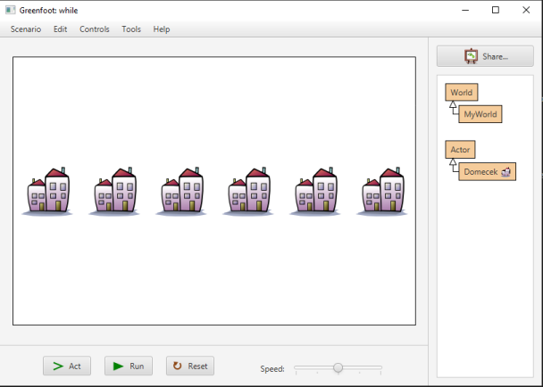
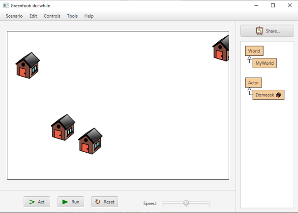
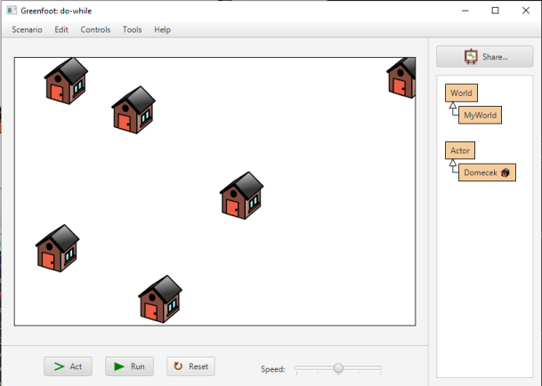
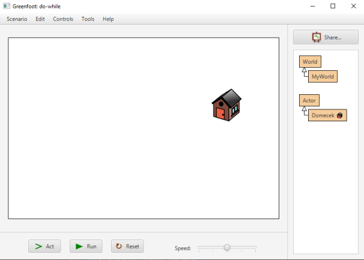

# Cyklus `while`
Někdy nevíme, kolikrát se má daná věc opakovat. Například načítáme položky ze souboru a&nbsp;nevíme předem, kolik položek bude. V&nbsp;takovém případě se cyklus `for` nehodí a&nbsp;je lépe použít cyklus `while`.

Syntaxe:
```java
while (podmínka)
{
	// Posloupnost příkazů:  
	// Co se má provádět, dokud je podmínka splněná.
}
```

Příklad použití cyklu `while`:

- Umísti na obrazovku domečky tak, že budou uprostřed obrazovky na ose Y a na ose X mezi nimi bude vždy mezera 100 pixelů.
- První domeček bude 50 pixelů od levého okraje obrazovky.
- Další domečky umisťuj tak dlouho, až narazíš na okraj obrazovky.



<details><summary>Řešení:</summary>

Uvádíme kód světa. Nezapomeň si také vytvořit třídu pro aktéra s&nbsp;názvem `Domecek`. Domeček nepotřebuje žádné úpravy, stačí aktéra vytvořit a přiřadit mu obrázek.

```java
import greenfoot.*;  // (World, Actor, GreenfootImage, Greenfoot and MouseInfo)

public class MyWorld extends World
{

    public MyWorld()
    {    
        super(600, 400, 1); 
        
        // Pro parametry zadání si vytvoříme konstanty (final):
        final int POZICE_PRVNIHO_DOMECKU = 50;
        final int ROZESTUP = 100;
        
        int poziceDomeckuX = POZICE_PRVNIHO_DOMECKU;
        // Domečky budou vertikálně (na ose Y) uprostřed obrazovky:
        int poziceDomeckuY = getHeight()/2;
        
        // Dokud souřadnice X nepřesáhne okraj obrazovky, 
        //  prováděj cyklus:
        while (poziceDomeckuX < getWidth()) {
            // Umísti nový domeček:
            addObject(new Domecek(), poziceDomeckuX, poziceDomeckuY);
            // Zvyš souřadnici X o ROZESTUP:
            poziceDomeckuX += ROZESTUP;
            // Šlo by i: poziceDomeckuX = poziceDomeckuX + ROZESTUP;
        }
    }
}
```

</details>


## Cyklus do-while
Pokud víš, že se nějaká operace má provést vždy minimálně jednou, můžeš použít také cyklus _do-while_. Při jeho použití a&nbsp;nejprve provedeme posloupnost příkazů a pak teprve testujeme splnění podmínky:

Syntaxe:
```java
do {
	// Posloupnost příkazů:  
	// Co se má provádět, dokud je podmínka splněná.
} while (podmínka)
```

Příklad použití cyklu _do-while_:

- Umisťuj na obrazovku domečky na náhodné souřadnice tak dlouho, dokud se některý domeček neobjeví na pravé čtvrtině polovině obrazovky.
- Počet domečku v&nbsp;prvních třech čtvrtinách obrazovky není důležitý (bude se měnit podle vygenerovaných náhodných pozic), ale v&nbsp;nejpravější čtvrtině obrazovky bude vždy jen jeden domeček &mdash; ten poslední, protože jeho umístěním konstruktor světa končí.

  


<details><summary>Řešení: _do-while_</summary>

Uvádíme kód světa. Nezapomeň si také vytvořit třídu pro aktéra s&nbsp;názvem `Domecek`. Domeček nepotřebuje žádné úpravy, stačí aktéra vytvořit a přiřadit mu obrázek.

```java
import greenfoot.*;  // (World, Actor, GreenfootImage, Greenfoot and MouseInfo)

public class MyWorld extends World
{

    public MyWorld()
    {    
        // Create a new world with 600x400 cells with a cell size of 1x1 pixels.
        super(600, 400, 1); 
        
        int poziceX, poziceY;
        int sirkaSveta = getWidth();
        int okrajPraveCtvrtiny = sirkaSveta/4*3;
        int vyskaSveta = getHeight();
        do {
            poziceX = Greenfoot.getRandomNumber(sirkaSveta);
            poziceY = Greenfoot.getRandomNumber(vyskaSveta);
            addObject(new Domecek(), poziceX, poziceY);
        } while (poziceX <= okrajPraveCtvrtiny);
    }
}
```

</details>

## Cyklus for-each
Pro práci se seznamy a&nbsp;dalšími kolekcemi také _for each_. Zatím jsme se pracovat se seznamy neučili, ale přesto si cyklus můžeš vyzkoušet třeba tak, že využiješ seznam všech objektů v&nbsp;Greenfootu:

Syntaxe:
```java
for (DatovyTyp promenna : seznam) {
	// Posloupnost příkazů:  
	// Co se má provádět, s každým objektem.
	// Každý objekt ze seznamu se umístí do proměnné a provede se s ním tento kód.
}
```

Příklad použití cyklu _for-each_:

- V&nbsp;každém kroku hry posuň všechny aktéry ve světě o 2&nbsp;pixely doprava.
- Vždy se posunou úplně všichni aktéři ve světě bez ohledu na jejich typ.
- Využijeme seznam všech aktérů ve světě.

<details><summary>Řešení: _for-each_</summary>

Uvádíme kód světa. Nezapomeň si také vytvořit třídu pro aktéra s&nbsp;názvem `Domecek`. Domeček nepotřebuje žádné úpravy, stačí aktéra vytvořit a přiřadit mu obrázek.

```java
import greenfoot.*;  // (World, Actor, GreenfootImage, Greenfoot and MouseInfo)

public class MyWorld extends World
{

    public MyWorld()
    {    
        super(600, 400, 1); 

        // V konstruktoru si vygenerujeme náhodně aktéry:
        int sirkaSveta = getWidth();
        int vyskaSveta = getHeight();
        
        // Umístíme náhodně 2 až 6 domečků:
        int pocetDomecku = Greenfoot.getRandomNumber(5)+2;
        for (int i = 0; i < pocetDomecku; i++) {
            int x = Greenfoot.getRandomNumber(sirkaSveta);
            int y = Greenfoot.getRandomNumber(vyskaSveta);
            addObject(new Domecek(), x,y);
        }
        // Umístíme náhodně 2 až 6 kytiček:
        int pocetKyticek = Greenfoot.getRandomNumber(5)+2;
        for (int i = 0; i < pocetKyticek; i++) {
            int x = Greenfoot.getRandomNumber(sirkaSveta);
            int y = Greenfoot.getRandomNumber(vyskaSveta);
            addObject(new Kyticka(), x,y);
        }
        // Můžeš si přidat i další aktéry, které si vytvoříš:
        // ...
    }
    public void act() 
    {
        // V metodě act se všemi aktéry budeme hýbat
        //  - bez ohledu na jejich typ:
        final int DELKA_KROKU = 2;
        
        // S každým aktérem ve světě proveď posun:
        for (Object objektVeSvete : getObjects(null)) {
            // Ve světě jsou jen aktéři. Řekneme tedy Javě, aby
            //  k objektu přistupovala tak, že je to aktér:
            // V programování se toto označuje jako „přetypování“
            Actor akter = (Actor) objektVeSvete;
            // Posuň aktéra:
            akter.move(DELKA_KROKU);
        }
    }
}
```

</details>


## Další materiály

Protože použití cyklů `while`, _do-while_ a _for-each_ není v&nbsp;Greenfootu tak časté, nebudeme se jimi zabývat příliš podrobně. Více si můžeš přečíst třeba na adrese: http://mis.e-mis.cz/index.php/Cykly 