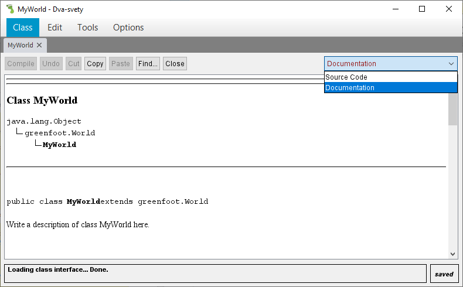

# Komentáře v kódu

Jak už jsme zmínili, může být užitečné si do kódu napsat poznámky. Počítači ale musí být jasné, co jsou naše poznámky a co je kód. Poznámky počítač bude ignorovat. Kód se pokusí provést a případně nás upozorní na chyby či jiné části, kterým nerozumí.

## Řádkové komentáře

Syntaxe – řádkový komentář:
Pokud použijeme kdekoli v kódu dvě lomítka ihned za sebou (bez mezery), vše co následuje na tomtéž řádku už se bere jako komentář.
```java
příkaz; // komentář 1
// komentář 2
```

Příklady – řádkový komentář:
```java
// Ověříme, zda nejsme na konci obrazovky: – komentář
if (this.getX() >= this.getWorld().getWidth())
{
	this.turn(180); // Pokud jsme na konci, otočíme se o 180°.
}
```

Jiný příklad:
```java
int pocet = 10;  // Proměnná typu číslo (toto je komentář)
```

## Blokové komentáře

Syntaxe – blokový komentář:
```java
Blokový komentář začíná znaky /* (lomítko a hvězdička). Následně pokračuje i přes konce řádků pořád dál a končí až použitím znaků */ (hvězdička a lomítko).
/* Blokový komentář může být
 * přes více řádků.
 * Doporučuje se každý další řádek začít hvězdičkou (*),
   ale není to povinné.
 */
 ```

Příklady – blokový komentář:

Například pokud nějaký kus kódu chceme dočasně „vyblokovat“, můžeme z něj udělat komentář.
```java
this.move(10);
/* Tento kus kódu teď nechceme používat – udělali jsme z něj komentář.
System.out.println("Testovací výpis…"); 
for (int i = 0; i < 10; i ++) 
{
   ... Sem později dopíšeme správné chování...
}
*/
this.konecHry();
```

Jiný příklad – do kódu si také můžeme vložit podrobnější vysvětlení na více řádků:
```java
/* Pokud poškození přesáhlo hodnotu 10,
 * pak ukončíme probíhající hru.
 */
if (this.poskozeni > 10)
{
	World svet = this.getWorld();
	svet.removeObject(this);
	svet.addObject(new GameOver(), svet.getWidth()/2, svet.getHeight()/2);
}
```

## Dokumentace kódu

Pokud víceřádkový komentář začíná znaky `/**` (lomítko a dvě hvězdičky), znamená to, že se může použít k automatickému vytváření dokumentace. Následně pokračuje i přes konce řádků pořád dál a končí až použitím znaků `*/` (hvězdička a lomítko – tedy stejně jako blokový komentář).

Všimněte si, že Greenfoot takto uvozuje každou třídu a každou metodu – to je dobrá praxe a doporučujeme to i vám.

Příklady – dokumentace kódu:
```java
/**
 * Víceřádkové vysvětlení, co dělá třída MyWorld.
 * Doporučuje se každý další řádek začít hvězdičkou (*),
   ale není to povinné.
 */
public class MyWorld
{
   //…
}
```

Dokumentaci v Greenfootu zobrazíte v pravém horním rohu volbou položky 

Dokumentace v rozbalovacím seznamu:
