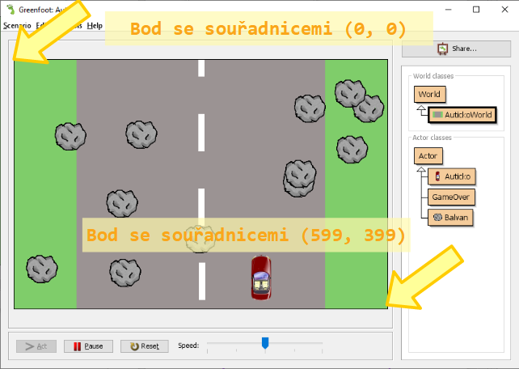
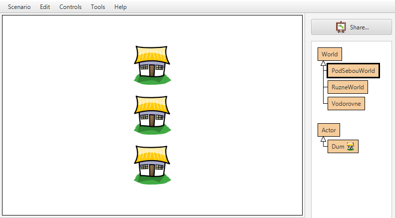
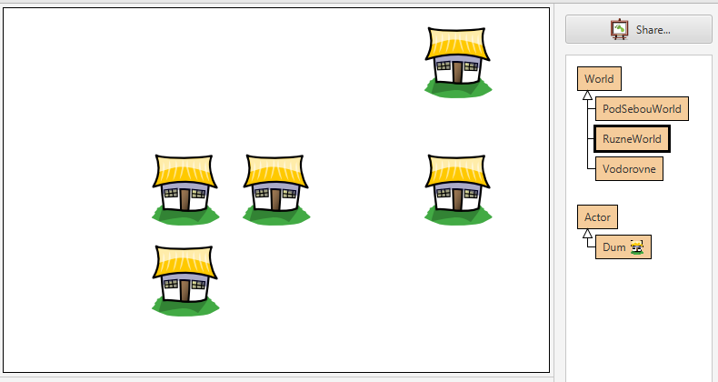
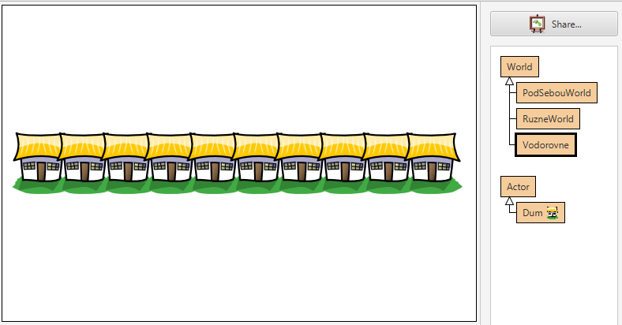
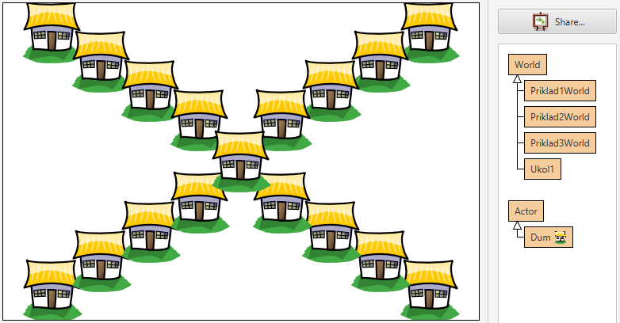
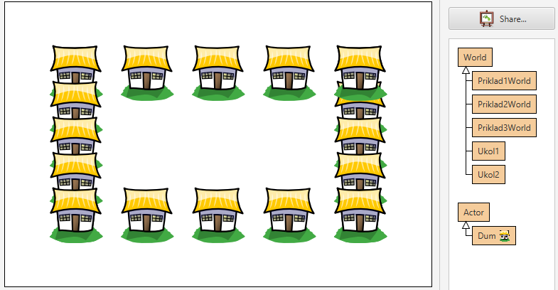

# Souřadnice ve hře

Už mnohokrát jsme umisťovali objekty do světa Greenfootu. Používali jsme metodu `addObject` a&nbsp;předávali jí objekt, který chceme do světa umístit a&nbsp;souřadnice, na které má být objekt umístěn. Pojďme si nyní podrobněji popsat, jak vlastně souřadnice v&nbsp;Greenfootu přesně fungují.

Podobně jako další frameworky pro tvorbu her používá Greenfoot pravoúhlou soustavu souřadnic. Na rozdíl od klasické kartézské soustavy souřadnic je ale bod se souřadnicemi (0, 0) vlevo nahoře. Souřadnice na ose X směrem doprava rostou, souřadnice na ose Y ale rostou směrem dolů. Standardní rozměr hrací plochy je 600×400 bodů, takže pravý dolní roh obrazovky má standardně souřadnice (599,399). Rozměry hrací plochy lze změnit, ale vždy bude (0, 0) vlevo nahoře a&nbsp;směrem dolů bude hodnota souřadnice Y vždy narůstat.



> Rozměry světa nejsou dány pevně na 600×400 bodů. Můžeme je nastavit v&nbsp;konstruktoru světa voláním konstruktoru třídy World:

> ```java
> super(novaSirka, novaVyska, pocetBoduNaDilek);
> ```

## Příklady:

Zkuste vytvořit několik podtříd třídy `World` a&nbsp;do každé z&nbsp;nich umístěte několik objektů (například instancí třídy `Dum`). 

Následující obrázky berte jako inspiraci k&nbsp;tomu, jak by objekty mohly být na obrazovce rozmístěny:





<details><summary>Řešení příkladu 1</summary>
    import greenfoot.*;

    /**
    * Kapitola Souřadnice - příklad 1 - tři domy pod sebou.
    * 
    * @author Martin Šimůnek 
    * @version 2020-02-06
    */
    public class Priklad1World extends World
    {
        public Priklad1World()
        {    
            super(600, 400, 1); 
            
            int x = 300;
            this.addObject(new Dum(), x, 100);
            this.addObject(new Dum(), x, 200);
            this.addObject(new Dum(), x, 300);
        }
    }
</details>

<details><summary>Řešení příkladu 2</summary>
    import greenfoot.*;

    /**
    * Kapitola Souřadnice - příklad 2 - různé rozmístění domů.
    * 
    * @author Martin Šimůnek 
    * @version 2020-02-06
    */
    public class Priklad2World extends World
    {
        public Priklad2World()
        {    
            super(600, 400, 1); 
            this.addObject(new Dum(), 200, 200);
            this.addObject(new Dum(), 200, 300);
            this.addObject(new Dum(), 300, 200);
            this.addObject(new Dum(), 500, 60);
            this.addObject(new Dum(), 500, 200);
        }
    }
</details>
<details><summary>Řešení příkladu 3</summary>
    import greenfoot.*;

    /**
    * Kapitola Souřadnice - příklad 3 - řada domů vedle sebe.
    * 
    * @author Martin Šimůnek 
    * @version 2020-02-06
    */
    public class Priklad3World extends World
    {
        public Priklad3World()
        {    
            super(600, 400, 1); 
            int x = 50;
            int pocet = 10;
            int krok = (int) (600-2*50)/(pocet-1);
            for (int i = 0; i < pocet; i++)
            {
                this.addObject(new Dum(), x, 200);
                x += krok;
            }
        }
    }
</details>

Vždy objekty umisťujte pomocí metody `addObject` v&nbsp;konstruktoru daného světa tak, abyste si vyzkoušeli práci se souřadnicemi.

## Vyzkoušej si!
Využij vědomosti z&nbsp;této kapitoly k&nbsp;řešení dalších úloh. Připrav pomocí metody `addObject` a&nbsp;souřadnic svět, který vypadá tak, jak je znázorněno na obrázku:





