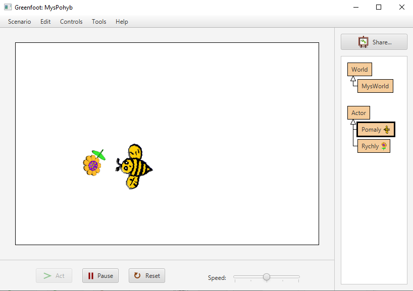

# Čtení informací z&nbsp;myši

Greenfoot nabízí metodu getMouseInfo(), která vrací informace o&nbsp;aktuálním stavu myši. 

## Čtení polohy myši
Pro získání souřadnic myši můžeme použít:

```java
MouseInfo mi = Greenfoot.getMouseInfo();
if (mi != null)
{
    int mysX = mi.getX();
    int mysY = mi.getY();
}
```

## Detekce stisku tlačítka

Zjištění, zda bylo stisknuto tlačítko myši, řeší metoda `Greenfoot.mouseClicked(null)`.

```java
if (Greenfoot.mouseClicked(null))
{
	System.out.println("Klik!");
}
```

Zda uživatel právě teď drží  tlačítko zjistíme takto:

```java
MouseInfo mi = Greenfoot.getMouseInfo();
if (mi != null)
{
    int cisloTlacitka = mi.getButton();
    // …
}
```

Metoda `getButton()` vrací číslo stisknutého tlačítka: `1`… levé, `2`… prostřední, `3` … pravé tlačítko.

Můžeme tedy pokračovat například takto:

```java
    if (cisloTlacitka == 1) System.out.println("Levé");
    else if (cisloTlacitka == 2)  System.out.println("Prostřední");
    else if (cisloTlacitka == 3)  System.out.println("Pravé");
```

## Příklady

### Příklad – aktér se pohybuje s&nbsp;myší
```java
public void act() {
    MouseInfo mi = Greenfoot.getMouseInfo();
    if (mi != null) {
        int mysX = mi.getX();
        int mysY = mi.getY();
        this.turnTowards(mysX, mysY);
        this.setLocation(mysX, mysY);
    }
}
```

### Příklad – aktér „honí“ myš – je za myší zpožděný

```java
int rychlost = 5;
/** Vzdálenost pomocí Pythagorovy věty */
public int vzdalenostKBodu(int x, int y) {
    double a = x-this.getX(); // délka odvěsny A: vzdálenost na ose X
    double b = y-this.getY(); // délka odvěsny B: vzdálenost na ose Y
    double c = Math.sqrt(a*a+b*b); // délka přepony: vzdálenost bodů
    return (int) c;
}
public void act() {
    MouseInfo mi = Greenfoot.getMouseInfo();
    if (mi != null) {
        int mysX = mi.getX();
        int mysY = mi.getY();
        int vzdalenost = vzdalenostKBodu(mysX, mysY);
        if (vzdalenost > 0) {
            this.turnTowards(mysX, mysY);
            this.move(Math.min(vzdalenost, rychlost)
        }
    }
}
```

## Úkol - Greenfoot: Hra „Kočka a myš“

Zkuste vytvořit hru se dvěma aktéry. Jeden bude „rychlý“, bude okamžitě následovat kurzor myši. Doporučujeme tomuto aktérovy dát název „Myš“ a&nbsp;přiřadit mu obrázek myši. Druhý aktér bude „pomalý“ – ke kurzoru myši bude stále směřovat, ale bude se k&nbsp;pozici kurzoru přibližovat pouze omezenou rychlostí. Aktérovi doporučujeme dát název „Kočka“ a&nbsp;přiřadit obrázek kočky.

> Protože ve standardní sadě Greenfootu obrázek kočky není, můžete použít také kytičku (rychlý aktér) a&nbsp;včelu, která poletí ke kytičce (pomalý aktér).

Každý z&nbsp;aktéru bude začínat na jiné pozici na obrazovce. Cílem hráče je pohybovat kurzorem myši tak, aby „pomalý“ aktér (kočka) nikdy nedohnal rychlého (myš).



### Rozšíření:
V&nbsp;okamžiku, kdy se jeden aktér dotkne druhého, má hráč trestný bod. K&nbsp;detekci kolize aktérů můžete použít funkci `getOneIntersectingObject(null)` z&nbsp;webu:
http://mis.e-mis.cz/index.php/Greenfoot#Zjištění_kolize_aktérů_ve_hře

Při deseti trestných bodech končí hra.

## Úkol – Greenfoot: Pohyb jen po ose X

Využijte znalostí z&nbsp;předchozího projektu a&nbsp;vytvořte aktéra, který se bude pohybovat jen po ose X:

 1. Když bude myš vpravo od aktéra, posune se aktér vpravo.
 2. Když bude myš vlevo od aktéra, posune se aktér vlevo.
 3. Aktér se nikdy nebude pohybovat nahoru ani dolů.
