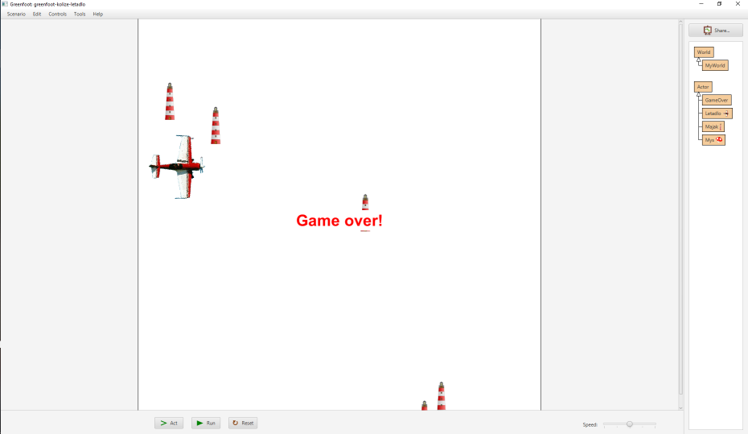

# Detekce kolize s aktérem

Pokud potřebuješ zjistit, jestli se tvůj aktér (předmět ve hře) srazil s jiným aktérem, můžeš použít metodu `isTouching` třídy `Actor`. 

> Protože je to metoda našeho aktéra, voláme ji pomocí klíčového slova `this`: `this.isTouching(...)`.

Jako parametr musíš metodě předat buď:
    • `null` &hellip; detekujete srážku s jakýmkoli aktérem/objektem.
    • `NazevTridy.class` … detekuje srážky jen s objekty třídy s daným názvem.

Můžeš také použít metodu `removeTouching(Trida.class)`, která odstraní ze světa všechny objekty třídy `Trida`, které se dotýkají našeho objektu.

## Příklad:
```java
public class Kamen
{
	public void act()
	{
		// Pokud se dotýkáme objektu třídy Hrac, ukonči hru:
		if (this.isTouching(Hrac.class))
		{
			Greenfoot.stop();    // Ukončí hru!
		}
		// Odstraň ze světa všechny objekty třídy Balonek:
		this.removeTouching(Balonek.class));
	}
}
```

## Úkol: Air Race!
Vytvořte hru, ve které se letadlo vyhýbá překážkám. Necháme se inspirovat závody Red Bull Air Race, ale úlohu si zjednodušíme – poletíme stále vpřed a budeme se pouze vyhýbat překážkám v podobě majáků.

Letadlo se bude pohybovat na levém okraji obrazovky. Pomocí šipek nahoru a dolů se bude posunovat vzhůru a dolů. Překážky (majáky) se budou objevovat na pravém okraji obrazovky a budou se pohybovat směrem vlevo. Když se maják srazí s letadlem (nebo se dostane příliš blízko), hra končí.
 
 

 1. Vytvořte aktéry letadlo a překážka (třeba obrázek kamene či majáku z Greenfootu).
 2. V konstruktoru světa (`MyWorld`) umístěte jedno letadlo na levý okraj obrazovky doprostřed.
 3. V metodě `act` světa zařiďte, aby se vygenerovalo náhodné číslo od `0` do `99`. Pokud je náhodné číslo `0`, přidá se na pravý okraj obrazovky nová překážka.
 4. Chování letadla: v reakci na šipky nahoru a dolů se pohybuje nahoru a dolů.
 5. Chování překážky/majáku:
     1. Pohybuje se k levému okraji obrazovky (volejte metodu `move()` a jako parametr dejte záporné číslo).
     2. Pokud dojde ke srážce s letadlem, ukončí hru. (Ukončení hry zařídíte voláním `Greenfoot.stop()`.)

## Výzva: Vylepšení Air Race!

 1. Zvětši svět pro letadlo tím, že upravíš v konstruktoru světa řádek:
    `super(600, 400, 1);`
    Nastav například:
    `super(1000, 1000, 1);`
    Tím získáš pro letadlo více prostoru.
 2. Jakmile hra skončí, zobrazte hlášení „Game over“. Postup pro zobrazení vyskakovacího hlášení najdete na stránce:  http://mis.e-mis.cz/index.php/Greenfoot:_Řešení_častých_úloh
 3. Do předchozí hry přidejte počítadlo času, které se vždy po 50 kolech hry zvýší o jedničku.

Realizaci počítadla můžeš převzít ze stránek: http://mis.e-mis.cz/index.php/Greenfoot:_Řešení_častých_úloh

Zvyšování počítadla prováděj v metodě `act` světa: zaveď si číselný atribut „odpočet“, který budete v každém kole zvyšovat. Jakmile bude větší než `50`, vynuluješ ho a zavoláš zvýšení počítadla o `1`.