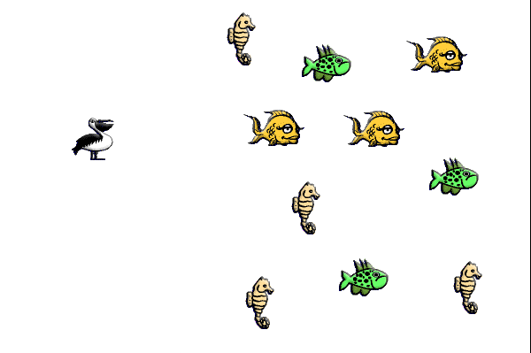

# Práce se seznamem

Seznam je objekt, která umí uložit více hodnot najednou – například více čísel, textů nebo aktérů. Představ si ho jako řadu při čekání na oběd: každý má své místo (pořadí) a můžeš se na konkrétní místo podívat, někoho přidat nebo odebrat.

## Jak vytvořit seznam?

V&nbsp;Javě použij třídu `ArrayList` a rozhraní `List`. Obojí si musíš na začátku souboru naimportovat:

```java
import java.util.List;
import java.util.ArrayList;

// ...
List<Jablko> seznamJablek = new ArrayList<>();
List<String> seznamJmen = new ArrayList<>();
List<Integer> seznamCisel = new ArrayList<>();
// ...
```
Tímto vytvoříš tři prázdné seznamy. Do jednoho můžeš ukládat aktéry třídy `Jablko`, do druhého jména (texty) a do třetího čísla (všimni si, že místo `int` musíš použít `Integer`).

## Přidání prvku do seznamu
```java
seznamJablek.add(new Jablko());
seznamJmen.add("Petr");
seznamCisel.add(5);
```
## Zjištění počtu prvků
	```java
	int pocet = seznamJmen.size();
	```
## Získání prvku na určité pozici (pozor, počítá se od nuly!)
	```java
	String prvni = seznamJmen.get(0);
	```
## Odebrání prvku
	```java
	seznamJmen.remove("Petr"); // Konkrétní prvek 
	seznamJmen.remove(0);      // Odebrání na základě pozice
	seznamJmeno.clear();	   // Odebrání všech prvků
	```
## Procházení všech prvků v seznamu
	```java
	for (Actor akter : seznamJablek) {
		 jablko.setLocation(Greenfoot.getRandomNumber(500), 100);
	}
	```

## Kolize s více aktéry zároveň

Někdy aktér může kolidovat s více jinými aktéry zároveň. Můžeš si vyžádat seznam kolidujích aktérů:
```java
List<Actor> kolidujici = getIntersectingObjects(Actor.class); 	 // beru všechny aktéry
List<Jablkko> kolidujici = getIntersectingObjects(Jablko.class); // Zajímají mě jen objekty třídy Jablko
List<Actor> kolidujici = getIntersectingObjects(null);    		 // Nerozlišuji třídu aktérů
```

Příklad použití:

```java
import greenfoot.*;
import java.util.List;
import java.util.ArrayList;

public class Inventory extends Actor
{
    // Seznam na ukládání předmětů:
    private List<Actor> inventar = new ArrayList<>();
	private final int ODSTUP = 50; 

    
    public void act()
    {
        MyWorld svet = (MyWorld) getWorld();
        
        // Posbírej aktéry
        List<Actor> kolidujici = getIntersectingObjects(Actor.class);
        for (Actor predmet : kolidujici) {
            inventar.add(predmet); // Přidej je do inventáře
            svet.removeObject(predmet); // Odstraň je ze světa
        }
		// Při stisknutí mezerníku je zase vyskládej
        if ("space".equals(Greenfoot.getKey()))
        {
            int poziceX = getX()+2*ODSTUP;
            int poziceY = getY();
            // Všechny předměty v inventáři umísti do světa:
            for (Actor predmet : inventar)
            {
                svet.addObject(predmet, poziceX, poziceY);
                poziceX += ODSTUP;
            }
            // Vymaž předměty z inventáře:
            inventar.clear();
	}
}
```

<!--

## Úkol: Rybí transportér

### Motivace:
Ryby se chtějí přesunovat rychleji. Domluvily se tedy s pelikánem, že je bude přepravovat v&nbsp;zobáku. Vytvořte hru, ve které pelikán sbírá ryby. Po stisku mezerníku všechny ryby zase vyskládá na obrazovku před sebe.

 

<details><summary>Nápověda: Postup</summary>

Letadlo:
 
 1. Vytvořte aktéra pro letadlo (obrázek letadlo).
 2. V&nbsp;konstruktoru světa (`MyWorld`) umístěte jedno letadlo na levý okraj obrazovky doprostřed.
 3. Když hráč stiskne šipky nahoru a&nbsp;dolů, letadlo se pohybuje nahoru a&nbsp;dolů po levém okraji obrazovky (na šipky doprava a doleva nereaguje).
 
 Překážky:

 4. Vytvořte aktéra pro překážku (obrázek maják či třeba kámen).
 5. Chování překážky/majáku:
     1. Pohybuje se k&nbsp;levému okraji obrazovky (volejte metodu `move()` a&nbsp;jako parametr dejte záporné číslo).
     2. Pokud dojde ke srážce s&nbsp;letadlem, ukončí hru. Ukončení hry zařídíte voláním `Greenfoot.stop()`.
 6. V&nbsp;metodě `act` světa zařiďte, aby se vygenerovalo náhodné číslo z&nbsp;rozsahu od `0` do `99`. Pokud je náhodné číslo `0`, přidá se na pravý okraj obrazovky nová překážka.
</details>

## Výzva: Vylepšení Air Race!

 1. Zvětši svět pro letadlo tím, že upravíš v&nbsp;konstruktoru světa řádek:
    `super(600, 400, 1);`
    Nastav například:
    `super(1000, 1000, 1);`
    Tím získáš pro letadlo více prostoru.
 2. Jakmile hra skončí, zobraz hlášení „Game over“. Postup pro zobrazení vyskakovacího hlášení najdeš na stránce:  http://mis.e-mis.cz/index.php/Greenfoot:_Řešení_častých_úloh
 3. Do předchozí hry přidej počítadlo času, které se vždy po 50 kolech hry zvýší o&nbsp;jedničku. Hráči tak mohou soutěžit, kdo vydrží déle ve hře.

<details><summary>Nápověda: Postup pro počítadlo času</summary>

Zvyšování počítadla prováděj v&nbsp;metodě `act` světa: zaveď si číselný atribut „odpočet“, který budeš v&nbsp;každém kole zvyšovat. Jakmile bude větší než `50`, vynuluješ odpočet a&nbsp;zavoláš zvýšení počítadla o `1`.

Realizaci počítadla můžeš převzít ze stránek: http://mis.e-mis.cz/index.php/Greenfoot:_Řešení_častých_úloh

</details>
-->