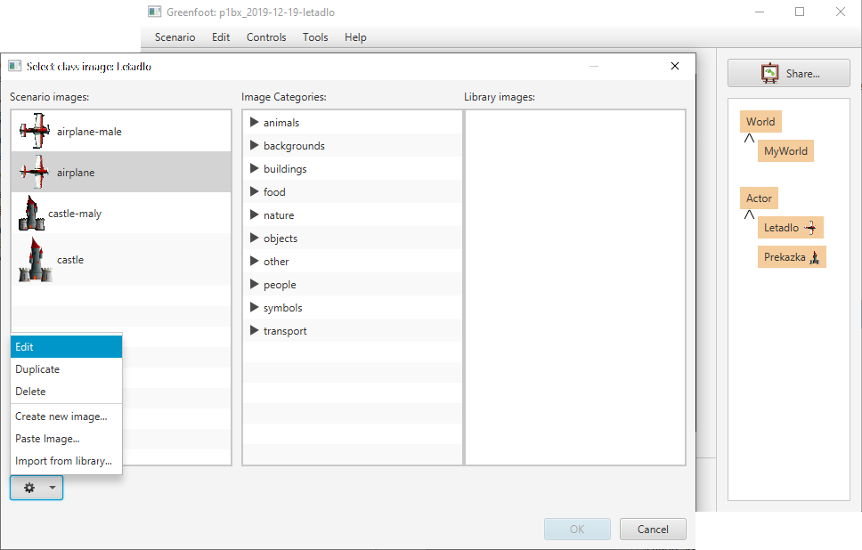

# Vlastní obrázky v&nbsp;Greenfootu

Pokud chceš ve hře využívat vlastní obrázky, nebo si upravit obrázky, které už v&nbsp;Greenfootu jsou, je to velmi jednoduché.

Pro přidání vlastních obrázků stačí:
    1. Nový obrázek přidat do složky `images` ve svém projektu.
    2. Následně kliknout na aktéra či svět pravým tlačítkem a&nbsp;vybrat _Set image…_ Nový obrázek již bude v&nbsp;nabídce v&nbsp;levé části okna.

Pokud chceš stávající obrázek upravit:
    1. Přiřaď původní obrázek některému aktérovi. Tím ho Greenfoot zkopíruje do složky `images` tvého projektu. 
    2. Následně klikni na aktéra pravým tlačítkem, vyber _Set image…_. Následně klikni na tlačítko s&nbsp;ozubeným kolečkem a&nbsp;vyber Edit. Obrázek se ti otevře v&nbsp;editoru obrázků a&nbsp;ty ho můžeš upravovat.

