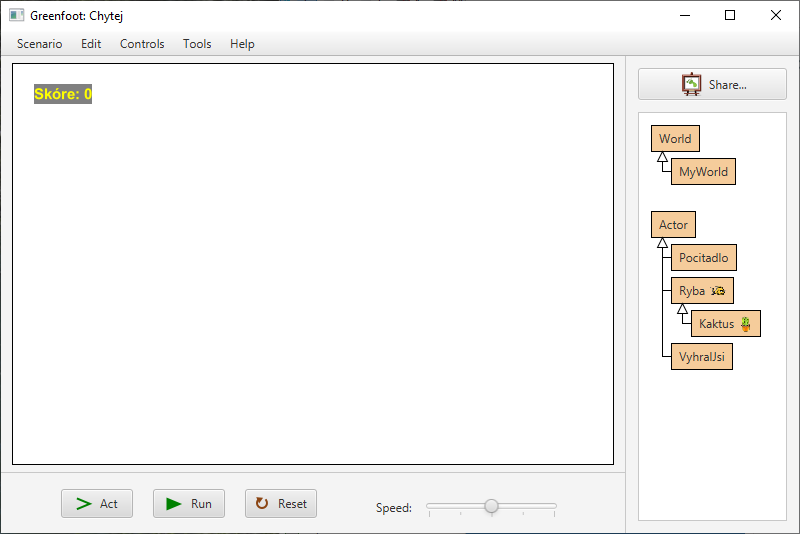
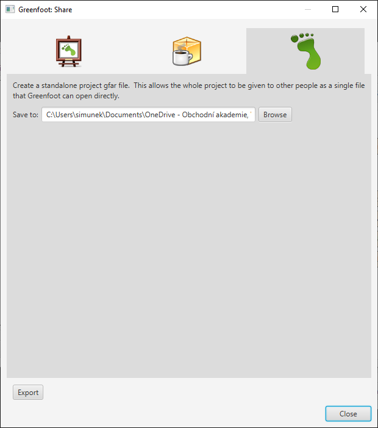

# Publikování hry

## Export balíčku GFAR
Zatím jsme si hru programovali sami pro sebe. Určitě bys ale chtěl umět hru jednoduše poslat kamarádům, nebo ji někomu nasdílet přes internet.

Dnes je asi nejjednodušším způsobem vyexportovat balíček GFAR a&nbsp;ten poslat:

1. Na hlavní obrazovce Greenfootu klikni na tlačítko _Share&hellip;_ v&nbsp;pravé horní části.
2. Klikni na ikonku Greenfootu.
3. Následně zvol _Export&hellip;_
4. Vedle adresáře s&nbsp;projektem tak vznikne nový soubor s&nbsp;příponou GFAR, který obsahuje veškeré zdrojové kódy i&nbsp;obrázky. Tento soubor můžeme komukoli poslat.
5. Po kliknutí na soubor GFAR se rozbalí celý projekt a&nbsp;spustí se v&nbsp;Greenfootu.

Příjemce musí mít také nainstalovaný Greenfoot, ale stažení a&nbsp;instalace Greenfootu jsou jednoduché, takže to jistě zvládne.

## Další způsoby publikování
Můžeš také svůj projekt nahrát na web [Greenfoot.org](https://www.greenfoot.org) nebo vyexportovat balíček _JAR_. Tyto způsoby ale v&nbsp;této knize nebudeme komentovat. Spouštění her z&nbsp;[Greenfoot.org](https://www.greenfoot.org) vyžaduje správné nastavení prohlížeče a&nbsp;i&nbsp;balíčky JAR vyžadují správné nastavení a&nbsp;spouštění Javy ručně.

Pokud chcete použít jiné způsoby exportu, využijte nápovědy na stránkách [Greenfoot.org](https://www.greenfoot.org).