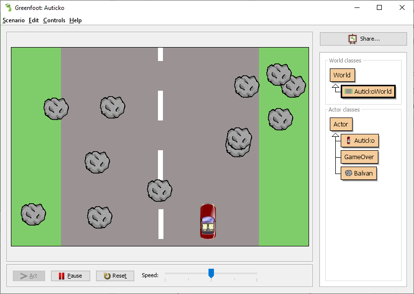

# Souhrnný úkol – hra Autíčko

> POZOR! Toto NENÍ návod pro úplné začátečníky!
>
> Návod na tvorbu hry předpokládá, že jsi již zvládl(a) základní pojmy objektového programování! Návod je záměrně psán tak, aby sis je musel(a) vybavit a&nbsp;tím si procvičil(a) správný zápis tříd, metod, vytváření proměnných, vytváření instancí atd.

## Motiv hry:

Hra bude spočívat v&nbsp;tom, že hráč bude ovládat autíčko, které se bude vyhýbat balvanům a&nbsp;přitom nesmí vyjet mimo silnici. Pokud hráč vyjede mimo silnici nebo narazí do balvanu, dochází k&nbsp;poškození autíčka. Jakmile poškození autíčka přesáhne stanovenou mez, hra končí.



## Co se máš naučit:

Máš si důkladně zopakovat základní programátorské konstrukce (cykly, podmínky, metody,…) a&nbsp;jejich zápis v&nbsp;Javě. 

## Možná rozšíření:
 1. Přidej do hry bonus – opravu automobilu

    Zvolte vhodný pohyb, může například padat stejně jako kameny.

    Pokud se autíčko bonusu dotkne, bonus umizí a&nbsp;sníží se poškození autíčka. 
    
    Jako obrázek můžeš použít buď barevné kuličky, nebo například obrázek plochého klíče či šroubováku.

## Nápověda

details><summary>Postup – první část: Projekt a&nbsp;pomocné třídy</summary>

 1. Vytvořte v&nbsp;Greenfootu nový projekt (scenario).

 2. Vytvořte třídu s&nbsp;názvem _Strom_ – bude potomkem (_subclass_) třídy `Actor`.

    Metoda `act` třídy _Strom_ bude provádět následující akce:
    
    1) Posune strom o&nbsp;jeden dílek dolů: `setLocation(getX(), getY()+1)`
    2) Pokud se dotýká okraje (`this.isAtEdge()`), nastaví souřadnici _Y_ na `50`: `setLocation(getX(), 50)`
    
    Stromy se budou stále posunovat dolů. Pokud narazí na okraj obrazovky, přesunou se zpět na horní okraj (na stejné souřadnici X).

 3. Vytvořte třídu s&nbsp;názvem _Game Over_ – bude potomkem (_subclass_) třídy `Actor`.
    Konstruktor třídy bude bez parametrů a&nbsp;v&nbsp;jeho kódu:

    1) Vytvořte proměnnou s&nbsp;názvem Obrázek GameOver, datový typ bude `GreenfootImage`.

    2) Uložte do proměnné Obrázek GameOver novou instanci třídy `GreenfootImage`. Konstruktor třídy `GreenfootImage` má čtyři parametry: 

        ```java
        new GreenfootImage("Game Over", 30, Color.RED, Color.BLACK);
        ```
        
    3) Zavolejte metodu _set image_ a&nbsp;předejte jí jako parametr hodnotu proměnné _Obrázek GameOver_.

        (Nastaví jako obrázek aktéra text „Game Over“ velikosti `30` bodů. Text bude červený na černém pozadí.)
</details>

details><summary>Postup – druhá část: Svět hry a&nbsp;stromy</summary>
 4. Vytvořte třídu s&nbsp;názvem AutíčkoWorld – bude potomkem (subclass) třídy `World`. Jako pozadí nastavte obrázek `AutickoPozadi.png` z&nbsp;balíčku _Resources_, který máte k&nbsp;této knize.

 5. V&nbsp;konstruktoru třídy _AutíčkoWorld_ proveďte:
    Vytvořte pomocí cyklu `5`&nbsp;instancí třídy Strom a&nbsp;umístěte je do světa na souřadnice:
    X&nbsp;náhodné číslo od `0`&nbsp;do `100`.
    Y&nbsp;náhodné číslo od `0`&nbsp;do souřadnice dolního okraje obrazovky (`this.getHeight()`).
</details>


details><summary>Postup – třetí část: Třída autíčko</summary>

 6. Vytvořte třídu s&nbsp;názvem Autíčko – bude potomkem (subclass) třídy `Actor`. Při vytváření třídy zvolte vhodný obrázek.

 7. Třída Autíčko bude mít atribut s&nbsp;názvem Poškození – celé číslo, na začátku nastavte na 0.

 8. Ve třídě Autíčko vytvořte metodu s&nbsp;názvem Poškoď. Metoda bude mít jeden parametr typu celé číslo a&nbsp;bude vracet také celé číslo. Metoda zvýší hodnotu atributu Poškození o&nbsp;hodnotu parametru a&nbsp;jako návratovou hodnotu vrátí výslednou hodnotu parametru Poškození.

 9. Ve třídě Autíčko vytvořte metodu s&nbsp;názvem Posun. Metoda bude mít jeden parametr typu celé číslo. Metoda nevrací žádnou hodnotu.

    Metoda posune autíčko v&nbsp;horizontální rovině (ve směru osy X) o&nbsp;počet dílků, který odpovídá hodnotě parametru délka. Pokud je délka větší než 0, posunujeme autíčko doprava, pokud je délka záporná, posunujeme autíčko doleva.

    Kód metody bude následující:
    ```java 
    this.setLocation(this.getX()+delka, this.getY());
    ```

 10. Ve třídě Autíčko vytvořte metodu s&nbsp;názvem Mimo silnici. Metoda nebude mít parametry a&nbsp;bude vracet logickou hodnotu (pravda/nepravda).
    V rámci metody:

        a) vytvořte logickou proměnnou s názvem _Výsledek_ a&nbsp;uložte do ní hodnotu nepravda.

        b) pokud je pozice autíčka (získáte voláním metody getX) větší než 500, uložte do logické proměnné Výsledek hodnotu pravda a autíčko posuňte o 50 bodů doleva voláním metody Posun.

        c) Pokud je pozice autíčka (získáte voláním metody getX) menší než 100, uložte do logické proměnné Výsledek hodnotu pravda a&nbsp;autíčko posuňte o&nbsp;50 bodů doprava voláním metody Posun.

        d) Vrátí hodnotu logické proměnné Výsledek.

 11. Vytvořte metodu Řízení. Bude bez parametrů, nebude vracet žádnou hodnotu. Kód metody bude následující:

        1) Pokud metoda `isKeyDown` s&nbsp;textovým parametrem `"left"` vrací logickou hodnotu pravda, zavolej metodu _Posun_ s&nbsp;parametrem `-5`.

        2) Pokud metoda isKeyDown s&nbsp;textovým parametrem "right" vrací logickou hodnotu pravda, zavolej metodu Posun s&nbsp;parametrem +5.
            (Reagujeme tím na stisk šipek na klávesnici a&nbsp;posunujeme autíčko vpravo nebo vlevo.)

 12. Vytvořte metodu Test konec hry bez parametrů a&nbsp;bez návratové hodnoty s&nbsp;následujícím kódem:

    Pokud je atribut Poškození větší než 10, spusť:

        ```java
        World svet = this.getWorld();
        svet.removeObject(this);
        svet.addObject(
                new GameOver(), svet.getWidth()/2, svet.getHeight()/2);
        ```

 13. V&nbsp;metodě _Act_ autíčka zavolejte metody _Řízení_ a&nbsp;_Mimo silnici_. Pokud metoda _Mimo silnici_ vrátí logickou hodnotu pravda, pak zavolej metodu _Poškoď_ s&nbsp;parametrem 1.
    Pak zavolejte metodu _Test konec hry_.

details><summary>Postup – čtvrtá část: umístění autíčka do světa</summary>
 
 14. V&nbsp;konstruktoru třídy _AutíčkoWorld_ proveďte:
    Vytvořte novou instanci třídy _Autíčko_.
    Spočtěte souřadnice autíčka: X&nbsp;bude polovina šířky světa (`this.getWidth()/2`), Y&nbsp;bude 50 bodů od dolního okraje obrazovky (`this.getHeight()-50`).
    Nově vytvořenou instanci autíčka umístěte do světa na pozici X, Y.

 15. V&nbsp;konstruktoru třídy AutíčkoWorld přidejte na hrací plochu 10 instancí třídy Strom. Souřadnice stromů určete takto:

        X: šířka světa mínus 100 + náhodné číslo od `0`&nbsp;do `99` (šířku světa získáte voláním metody `getWidth`).

        Y: náhodné číslo od 0&nbsp;do výšky světa (výšku světa získáte voláním metody `getHeight()`).

## Postup – padající balvany
 16. Vytvořte třídu s&nbsp;názvem Balvan – bude potomkem (subclass) třídy Actor. Třída bude mít atributy Pozice X, Pozice Y, Počítadlo a&nbsp;Rychlost (jsou to celá čísla).

    Konstruktor třídy bude mít parametr Šířka světa (celé číslo). Konstruktor nastaví Počítadlo a&nbsp;Pozici Y&nbsp;na 0&nbsp;a `Pozici X`&nbsp;na náhodné číslo od 0&nbsp;do Šířky světa. Atribut Rychlost nastaví na 1. Dále k&nbsp;atributu Rychlost přičte náhodné číslo od 0&nbsp;do 10.

 17. Třída Balvan bude mít metodu s&nbsp;názvem Naraz do auta. Metoda je bez parametrů, vrací logickou hodnotu. Kód metody je následující:

        ```java
        Auticko kolize = 
            (Auticko) this.getOneIntersectingObject(Auticko.class);
        if (kolize != null) 
        {
            kolize.poskod(3);
            return true;
        }
        return false;
        ```

        (Detekuje kolizi s autíčkem, pokud nastane, poškodí autíčko a vrací „pravda“, jinak vrací „nepravda“.)

 18. V metodě _Act_ třídy _Balvan_:

        1) Zvyšte hodnotu atributu Počítadlo o 1,

        2) Pokud je hodnota Počítadlo větší než hodnota atributu Rychlost, nastavte Počítadlo na 0 a zvyšte Pozice Y o 3.

        3) Zavolejte metodu _Set Location_ a předejte jí parametry Pozice X a Pozice Y. (Metoda _Set Location_ už existuje, získali jsme ji od třídy `Actor`).

        4) Vytvořte logickou proměnnou s názvem Odstraň.

        5) Zavolejte metodu Náraz do auta a výsledek metody uložte do proměnné Odstraň.

        6) Pokud je Pozice Y větší nebo rovna výšce světa, do proměnné Odstraň uložte hodnotu „pravda“:

        7) Pokud je v proměnné Odstraň logická hodnota „pravda“, odstraňte balvan ze světa:

            ```java
            this.getWorld().removeObject(this)
            ```

 19. V metodě _Act_ světa (třídy _AutíčkoWorld_):

        1) Vygenerujte náhodné číslo od `0` do `199`.

        2) Pokud je náhodné číslo menší než `2`, vytvořte nový balvan a umístěte ho do světa na pozici _(-100, -100)_.

</details>
